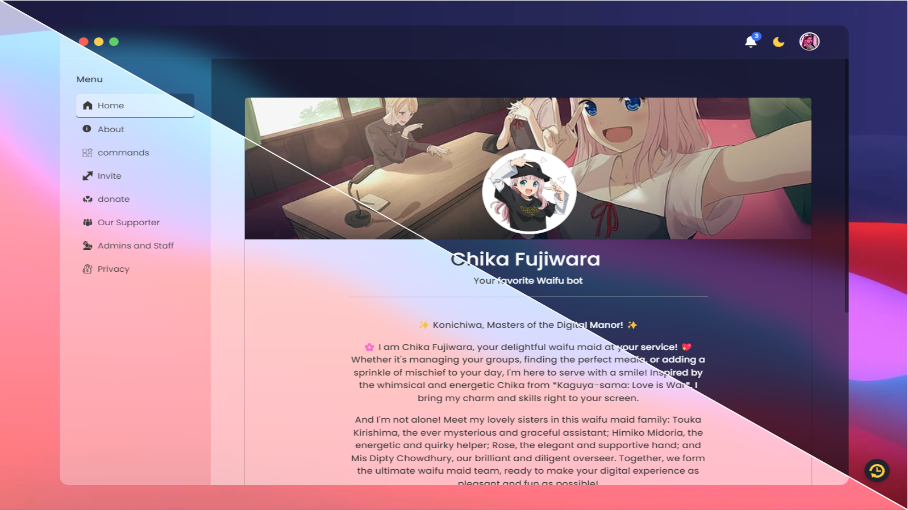
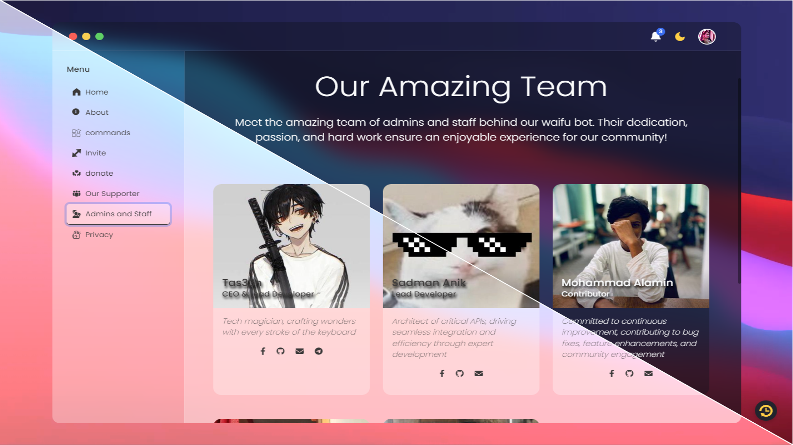
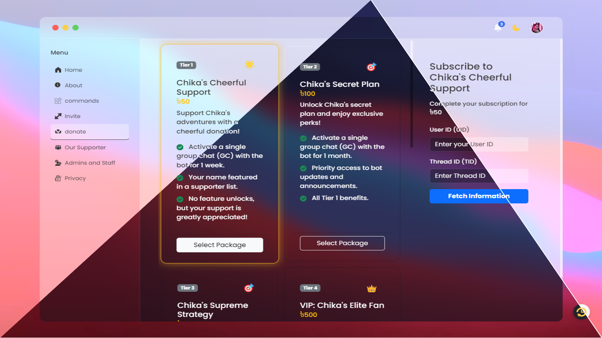

# CHIKA DONATION PORTAL

<p align="center">
  
</p>
<p align="center">
  
  
</p>

### Description:

CHIKA DONATION PORTAL is a single-page web application designed to facilitate donations for the CHIKA messenger bot project. This portal provides an easy-to-use interface for supporters to contribute to the bot's development and maintenance.

Author: [tas33n](https://github.com/tas33n)

Modified by: [Mero](https://github.com/meroitachi)

## Key changes and features

- 🌟 Single-page application built with HTML, CSS, and JavaScript
- 🕹️ Converted from Cloudflare Workers to Express.js for better flexibility
- ~💼 Cloudflare Workers integration for serverless deployment~ **(coming soon)**
- 📧 Replaced bKash payment gateway with email confirmation-based donation process
- ✔️ Admin can verify or cancel the payment from the panel, and users will receive a confirmation email based on the action (verified or canceled)
- 📊 Dynamic package selection and user information display
- 👥 Admin and supporter showcase sections
- 🌙 Dark mode toggle for user preference
- 📱 Responsive design for various device sizes
- 🐛 Many loading and other bugs fixed in the Express version

## Technologies Used

- HTML5
- CSS3 (with Bootstrap for styling)
- JavaScript
- jQuery for DOM manipulation
- Express.js for server-side logic
- Nodemailer and [Brevo](https://brevo.com/) SMTP for email-based confirmation

## Setup and Installation

1. Clone the repository:

```bash
git clone https://github.com/meroitachi/chika-donation-alt/
```

2. Navigate to the project directory:

```bash
cd /chika-donation-alt
```

3. Install dependencies:

```bash
npm install
```

4. Configure the Express.js app:

- Update your configurations (e.g., APP_URL, CDN src, Bot API) in `express.js`, `app.js`, and `service-worker.js`.

5. Brevo SMTP setup for email configuration:

**Note:** If you want to use your bot project's email sending SMTP function to send emails through your bot API, you can change the option

- Create an account on [brevo.com](brevo.com), go to `Senders, Domains & Dedicated IPS` option and add a sender email, (such as 'your email@.gmail.com')
- Go to the `SMTP & API` option, create a new SMTP key, and copy the login and password (SMTP key). Then, add it to the SMTP configuration in the `sendMail()` function.

6. Start the server:

- You can start the server by running

```bash
node src/express.js
```

## Usage

After deployment, users can access the donation portal through the Express server’s URL. They can:

1. Browse donation packages
2. Select a package and enter their user and thread IDs
3. Submit their payment info, which sends an email to the admin for verification
4. Admin can verify or cancel the request in web panel
5. Users receive a success or cancellation email based on the admin's action

## Contributing

We welcome contributions to the chika donation-alt project! If you'd like to contribute, please:

1. Fork the repository
2. Create a new branch for your feature
3. Commit your changes
4. Push to your branch
5. Create a pull request

Please ensure your code adheres to the existing style and includes appropriate comments.

#### You can check the original version of this project:

Main project: [CHIKA DONATION PORTAL](https://github.com/tas33n/CHIKA-DONATION-PORTAL/)  
Author: [Tas33n](https://github.com/tas33n)
